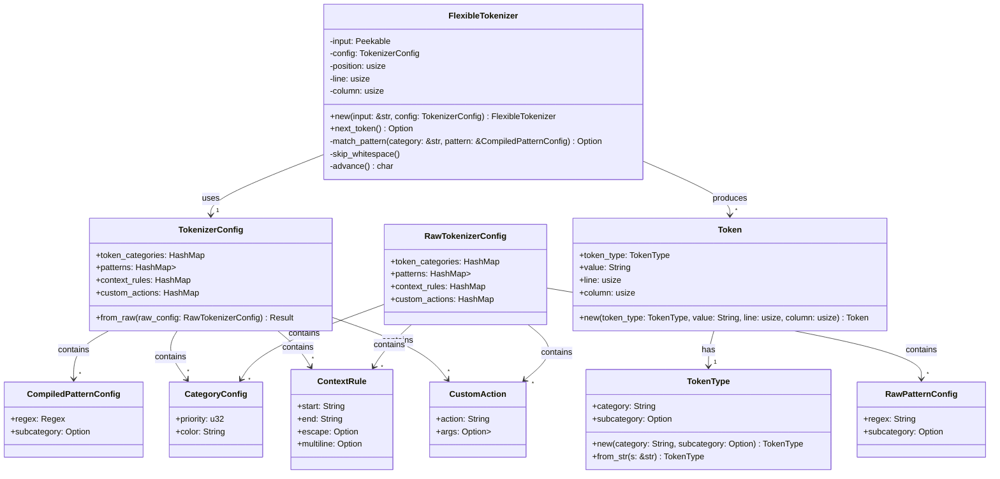
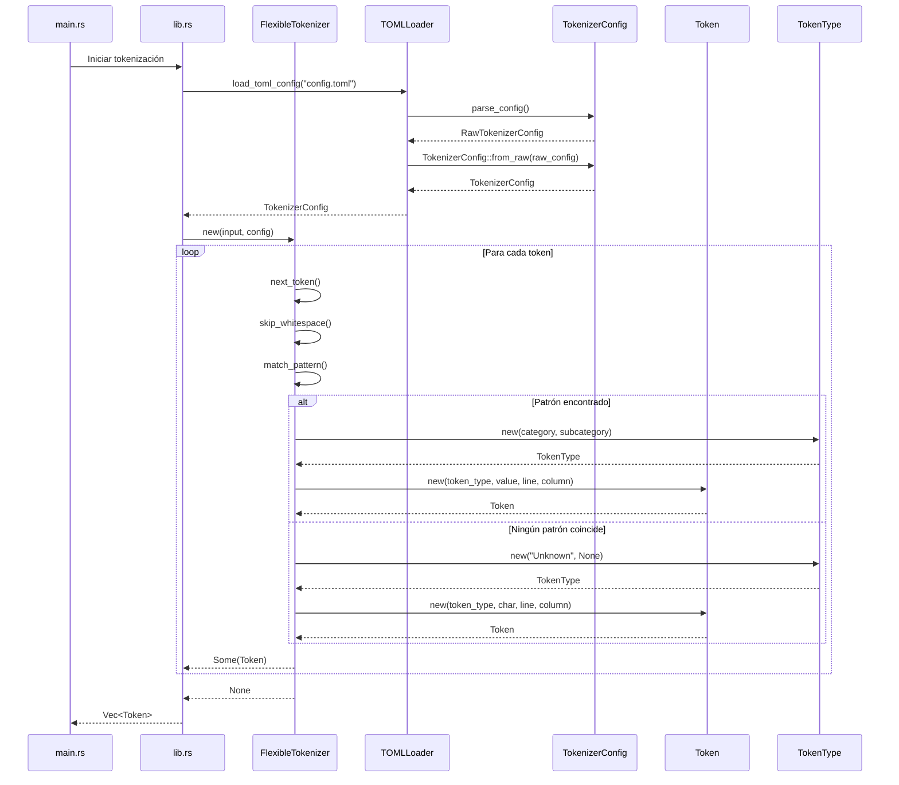
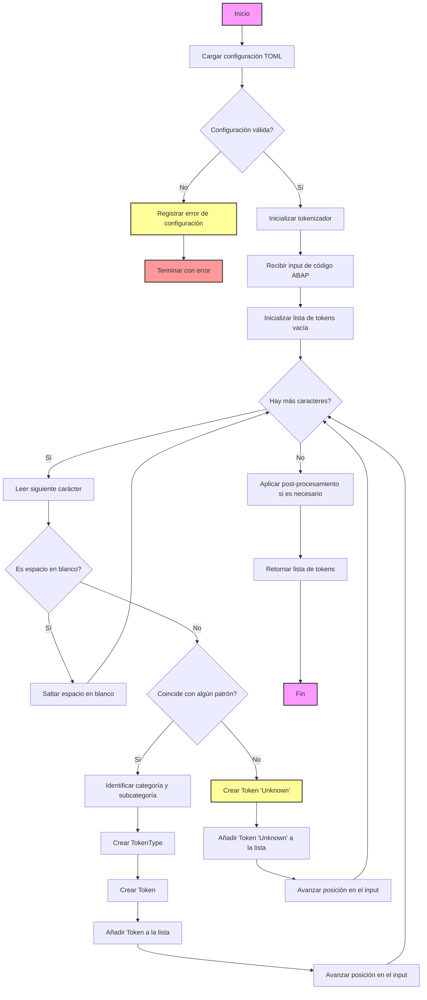

# Diseño del Tokenizador ABAP Flexible

## Introducción

Este documento describe el diseño de un tokenizador flexible para el lenguaje ABAP (Advanced Business Application Programming). El tokenizador está diseñado para ser configurable, extensible y capaz de manejar las complejidades específicas del lenguaje ABAP.

## Objetivos del Diseño

1. Crear un tokenizador altamente configurable para ABAP.
2. Permitir la fácil extensión y modificación de reglas de tokenización.
3. Facilitar la integración con herramientas de análisis y desarrollo.
4. Facilitar la adaptación a diferentes variantes de ABAP.

## Estructura del Sistema

## Estructura del Sistema

El sistema se compone de los siguientes elementos principales:

1. **TokenType** (`token_type.rs`): Una estructura flexible que representa diferentes tipos de tokens, con soporte para categorías y subcategorías opcionales.

2. **Token** (`token.rs`): Representa un token individual en el código ABAP, incluyendo su tipo, valor, y posición en el código fuente.

3. **FlexibleTokenizer** (`flexible_tokenizer.rs`): La clase principal que coordina el proceso de tokenización, utilizando la configuración TOML para determinar cómo tokenizar el input.

4. **TokenizerConfig** (`config/tokenizer_config.rs`): Encargada de representar la configuración cargada desde el archivo TOML.

5. **Módulo de configuración** (`config/mod.rs` y `config/toml_loader.rs`): Maneja la carga y parsing del archivo de configuración TOML.

6. **Módulo principal del tokenizador** (`mod.rs`): Actúa como punto de entrada para el módulo del tokenizador, re-exportando las estructuras y funciones públicas.

## Estructura de Archivos 
```
abap_tokenizer/
├── Cargo.toml
├── src/
│   ├── main.rs
│   ├── lib.rs
│   ├── config/
│   │   ├── mod.rs
│   │   ├── tokenizer_config.rs
│   │   └── toml_loader.rs
│   ├── tokenizer/
│   │   ├── mod.rs
│   │   ├── flexible_tokenizer.rs
│   │   ├── token.rs
│   │   └── token_type.rs
│   └── error.rs
└── config/
    └── default_config.toml
```

### Explicación de la Estructura

1. **Raíz del Proyecto**
   - `Cargo.toml`: Manifiesto del proyecto Rust.
   - `Cargo.lock`: Archivo de bloqueo de dependencias.
   - `README.md`: Documentación principal del proyecto.

2. **src/**
   - `main.rs`: Punto de entrada para la aplicación de línea de comandos.
   - `lib.rs`: Punto de entrada para la biblioteca.

3. **src/tokenizer/**
   - `mod.rs`: Define el módulo del tokenizador.
   - `flexible_tokenizer.rs`: Implementación principal del tokenizador flexible.
   - `token.rs`: Definición de la estructura Token.
   - `token_type.rs`: Definición de la estructura TokenType.

4. **src/config/**
   - `mod.rs`: Define el módulo de configuración.
   - `tokenizer_config.rs`: Estructura y lógica de la configuración del tokenizador.
   - `toml_loader.rs`: Funcionalidad para cargar y parsear archivos TOML.

5. **src/matchers/**
   - Contiene módulos separados para cada tipo de matcher (keyword, identifier, etc.).
   - Cada matcher se encarga de reconocer un tipo específico de token.

6. **src/error/**
   - `tokenizer_error.rs`: Definiciones de errores específicos del tokenizador.

7. **src/utils/**
   - `logger.rs`: Utilidad para logging.

8. **tests/**
   - `integration_tests.rs`: Pruebas de integración.
   - `test_data/`: Directorio con datos de prueba.

9. **benches/**
   - `tokenizer_benchmark.rs`: Benchmarks para medir el rendimiento del tokenizador.

10. **examples/**
    - `simple_tokenization.rs`: Ejemplo de uso básico del tokenizador.

11. **config/**
    - `default_config.toml`: Configuración TOML por defecto para el tokenizador.


#### Tabla de Descripción de Archivos del Tokenizador ABAP Flexible:


| Nombre del Archivo | Ruta | Función | Interacciones |
|--------------------|------|---------|---------------|
| main.rs | /src/main.rs | Punto de entrada para la aplicación de línea de comandos | Interactúa con lib.rs y flexible_tokenizer.rs |
| lib.rs | /src/lib.rs | Punto de entrada para la biblioteca, define la estructura del módulo | Interactúa con todos los módulos en src/ |
| mod.rs | /src/tokenizer/mod.rs | Define el módulo del tokenizador | Interactúa con flexible_tokenizer.rs, token.rs, y token_type.rs |
| flexible_tokenizer.rs | /src/tokenizer/flexible_tokenizer.rs | Implementación principal del tokenizador flexible | Interactúa con token.rs, token_type.rs, y tokenizer_config.rs |
| token.rs | /src/tokenizer/token.rs | Define la estructura Token | Utilizado por flexible_tokenizer.rs |
| token_type.rs | /src/tokenizer/token_type.rs | Define la estructura TokenType | Utilizado por token.rs y flexible_tokenizer.rs |
| mod.rs | /src/config/mod.rs | Define el módulo de configuración | Interactúa con tokenizer_config.rs y toml_loader.rs |
| tokenizer_config.rs | /src/config/tokenizer_config.rs | Define las estructuras para la configuración del tokenizador | Interactúa con toml_loader.rs y flexible_tokenizer.rs |
| toml_loader.rs | /src/config/toml_loader.rs | Carga y parsea el archivo de configuración TOML | Interactúa con tokenizer_config.rs |
| mod.rs | /src/utils/mod.rs | Define el módulo de utilidades | Interactúa con logger.rs |
| logger.rs | /src/utils/logger.rs | Implementa funcionalidades de logging | Utilizado potencialmente por todos los otros módulos |
| integration_tests.rs | /tests/integration_tests.rs | Contiene pruebas de integración para el tokenizador | Interactúa con lib.rs y flexible_tokenizer.rs |
| valid_abap_code.abap | /tests/test_data/valid_abap_code.abap | Archivo de prueba con código ABAP válido | Utilizado por integration_tests.rs |
| invalid_abap_code.abap | /tests/test_data/invalid_abap_code.abap | Archivo de prueba con código ABAP inválido | Utilizado por integration_tests.rs |
| tokenizer_benchmark.rs | /benches/tokenizer_benchmark.rs | Contiene benchmarks para medir el rendimiento del tokenizador | Interactúa con lib.rs y flexible_tokenizer.rs |
| simple_tokenization.rs | /examples/simple_tokenization.rs | Ejemplo de uso básico del tokenizador | Interactúa con lib.rs y flexible_tokenizer.rs |
| default_config.toml | /config/default_config.toml | Configuración TOML por defecto para el tokenizador | Utilizado por toml_loader.rs |
| Cargo.toml | /Cargo.toml | Manifiesto del proyecto Rust, define dependencias y metadatos | Interactúa con todos los archivos del proyecto a través de la gestión de dependencias |
| Cargo.lock | /Cargo.lock | Archivo de bloqueo de dependencias | Generado automáticamente basado en Cargo.toml |
| README.md | /README.md | Documentación principal del proyecto | N/A |


### Beneficios de esta Estructura

1. **Separación de Responsabilidades**: Cada módulo y archivo tiene una responsabilidad clara y bien definida.
2. **Facilidad de Mantenimiento**: La organización lógica facilita encontrar y modificar componentes específicos.
3. **Escalabilidad**: Fácil de extender con nuevos matchers o funcionalidades.
4. **Testabilidad**: Estructura que facilita la escritura de pruebas unitarias y de integración.
5. **Claridad**: La estructura refleja la arquitectura del sistema, mejorando la comprensión del proyecto.
6. **Modularidad**: Permite trabajar en diferentes partes del sistema de forma independiente.

Esta estructura proporciona una base sólida para el desarrollo y mantenimiento a largo plazo del tokenizador ABAP flexible.

## Configuración TOML

El archivo de configuración TOML es una parte crucial del sistema diseñado. Define los tipos de tokens, patrones y reglas especiales que el tokenizador utilizará. Aquí se presenta un ejemplo detallado de cómo podría ser este archivo de configuración:

```toml

# Configuración del Tokenizador ABAP Flexible

[metadata]
language_version = "ABAP 7.5"
case_sensitive = false
allow_unicode_identifiers = true

[token_categories]
Keyword = { priority = 1, color = "blue" }
Identifier = { priority = 2, color = "black" }
Literal = { priority = 3, color = "green" }
Operator = { priority = 4, color = "red" }
Punctuation = { priority = 5, color = "gray" }
Comment = { priority = 6, color = "green" }

[patterns]
Keyword = [
    { regex = "\\b(IF|ELSE|ENDIF|CASE|ENDCASE|DO|ENDDO|WHILE|ENDWHILE|LOOP|ENDLOOP)\\b", subcategory = "ControlFlow" },
    { regex = "\\b(DATA|TYPES|CONSTANTS|FIELD-SYMBOLS)\\b", subcategory = "Declaration" },
    { regex = "\\b(SELECT|FROM|WHERE|ORDER BY|GROUP BY|HAVING)\\b", subcategory = "Database" },
    { regex = "\\b(FORM|ENDFORM|PERFORM|METHOD|ENDMETHOD|FUNCTION|ENDFUNCTION)\\b", subcategory = "Subroutine" },
    { regex = "\\b(CLASS|ENDCLASS|INTERFACE|ENDINTERFACE)\\b", subcategory = "OOP" }
]

Identifier = [
    { regex = "[a-zA-Z_][a-zA-Z0-9_]*" }
]

Literal = [
    { regex = "'[^']*'", subcategory = "String" },
    { regex = "`[^`]*`", subcategory = "String" },
    { regex = "\\b\\d+\\b", subcategory = "Integer" },
    { regex = "\\b\\d+\\.\\d+\\b", subcategory = "Float" }
]

Operator = [
    { regex = "\\+|-|\\*|/|=|<>|<=|>=|<|>|\\bAND\\b|\\bOR\\b|\\bNOT\\b" }
]

Punctuation = [
    { regex = "[.,():;\\[\\]{}]" }
]

Comment = [
    { regex = "\\*.*$", subcategory = "LineComment" },
    { regex = "\".*$", subcategory = "LineComment" }
]

[context_rules]
StringLiteral = { start = "'", end = "'", escape = "''", multiline = true }
TemplateString = { start = "|", end = "|", escape = "||", multiline = true }

[special_rules]
FieldSymbol = { start = "<", end = ">", allow_nested = false }
Pragma = { start = "#", regex = "#[A-Z]+", process_as = "Keyword" }

[custom_actions]
Pragma = { action = "ProcessPragma" }
TemplateString = { action = "ProcessTemplateString" }

```


Claro, con gusto le proporcionaré un ejemplo del archivo de configuración TOML que sería compatible con nuestro tokenizador ABAP flexible optimizado. Este ejemplo ilustrará cómo definir diferentes categorías de tokens, patrones, y reglas especiales.


Aquí está un ejemplo de un archivo de configuración TOML para nuestro tokenizador ABAP flexible:

```toml
# Configuración del Tokenizador ABAP Flexible

[metadata]
language_version = "ABAP 7.5"
case_sensitive = false
allow_unicode_identifiers = true

[token_categories]
Keyword = { priority = 1, color = "blue" }
Identifier = { priority = 2, color = "black" }
Literal = { priority = 3, color = "green" }
Operator = { priority = 4, color = "red" }
Punctuation = { priority = 5, color = "gray" }
Comment = { priority = 6, color = "green" }

[patterns]
Keyword = [
    { regex = "\\b(IF|ELSE|ENDIF|CASE|ENDCASE|DO|ENDDO|WHILE|ENDWHILE|LOOP|ENDLOOP)\\b", subcategory = "ControlFlow" },
    { regex = "\\b(DATA|TYPES|CONSTANTS|FIELD-SYMBOLS)\\b", subcategory = "Declaration" },
    { regex = "\\b(SELECT|FROM|WHERE|ORDER BY|GROUP BY|HAVING)\\b", subcategory = "Database" },
    { regex = "\\b(FORM|ENDFORM|PERFORM|METHOD|ENDMETHOD|FUNCTION|ENDFUNCTION)\\b", subcategory = "Subroutine" },
    { regex = "\\b(CLASS|ENDCLASS|INTERFACE|ENDINTERFACE)\\b", subcategory = "OOP" }
]

Identifier = [
    { regex = "[a-zA-Z_][a-zA-Z0-9_]*" }
]

Literal = [
    { regex = "'[^']*'", subcategory = "String" },
    { regex = "`[^`]*`", subcategory = "String" },
    { regex = "\\b\\d+\\b", subcategory = "Integer" },
    { regex = "\\b\\d+\\.\\d+\\b", subcategory = "Float" }
]

Operator = [
    { regex = "\\+|-|\\*|/|=|<>|<=|>=|<|>|\\bAND\\b|\\bOR\\b|\\bNOT\\b" }
]

Punctuation = [
    { regex = "[.,():;\\[\\]{}]" }
]

Comment = [
    { regex = "\\*.*$", subcategory = "LineComment" },
    { regex = "\".*$", subcategory = "LineComment" }
]

[context_rules]
StringLiteral = { start = "'", end = "'", escape = "''", multiline = true }
TemplateString = { start = "|", end = "|", escape = "||", multiline = true }

[special_rules]
FieldSymbol = { start = "<", end = ">", allow_nested = false }
Pragma = { start = "#", regex = "#[A-Z]+", process_as = "Keyword" }

[custom_actions]
Pragma = { action = "ProcessPragma" }
TemplateString = { action = "ProcessTemplateString" }

```

Explicación de las secciones principales:

1. `[metadata]`: Contiene información general sobre la configuración del tokenizador.

2. `[token_categories]`: Define las categorías principales de tokens, cada una con una prioridad y un color para posible resaltado de sintaxis.

3. `[patterns]`: Aquí se definen los patrones de expresiones regulares para cada categoría de token. Cada patrón puede tener una subcategoría opcional.

   - `Keyword`: Incluye patrones para diferentes tipos de palabras clave en ABAP.
   - `Identifier`: Patrón para identificadores válidos en ABAP.
   - `Literal`: Patrones para diferentes tipos de literales (cadenas, enteros, flotantes).
   - `Operator`: Patrón para operadores aritméticos y lógicos.
   - `Punctuation`: Patrón para símbolos de puntuación.
   - `Comment`: Patrones para comentarios de línea.

4. `[context_rules]`: Define reglas para tokens que requieren un contexto de inicio y fin, como cadenas de texto que pueden abarcar múltiples líneas.

5. `[special_rules]`: Reglas para casos especiales como símbolos de campo y pragmas.

6. `[custom_actions]`: Define acciones personalizadas que el tokenizador puede realizar para ciertos tipos de tokens.


Esta estructura permite una fácil extensión y modificación de las reglas de tokenización sin necesidad de cambiar el código del tokenizador.

## Componentes Principales

## Componentes Principales

### TokenType

```rust
pub struct TokenType {
    pub category: String,
    pub subcategory: Option<String>,
}

impl TokenType {
    pub fn new(category: String, subcategory: Option<String>) -> Self;
    pub fn from_str(s: &str) -> Self;
}
```

### Token

```rust
pub struct Token {
    pub token_type: TokenType,
    pub value: String,
    pub line: usize,
    pub column: usize,
}

impl Token {
    pub fn new(token_type: TokenType, value: String, line: usize, column: usize) -> Self;
}
```

### FlexibleTokenizer

```rust
pub struct FlexibleTokenizer<'a> {
    input: Peekable<Chars<'a>>,
    config: TokenizerConfig,
    position: usize,
    line: usize,
    column: usize,
}

impl<'a> FlexibleTokenizer<'a> {
    pub fn new(input: &'a str, config: TokenizerConfig) -> Self;
    pub fn next_token(&mut self) -> Option<Token>;
    fn match_pattern(&mut self, category: &str, pattern: &PatternConfig) -> Option<Token>;
    fn skip_whitespace(&mut self);
    fn advance(&mut self) -> char;
}
```

### TokenizerConfig

```rust
pub struct TokenizerConfig {
    pub token_categories: HashMap<String, CategoryConfig>,
    pub patterns: HashMap<String, Vec<PatternConfig>>,
    pub context_rules: HashMap<String, ContextRule>,
    pub custom_actions: HashMap<String, CustomAction>,
}

impl TokenizerConfig {
    pub fn load(path: &str) -> Result<Self, Box<dyn Error>>;
}
```

## Flujo de Trabajo

1. Carga de la configuración TOML.
2. Inicialización del tokenizador con la configuración cargada.
3. Recepción del código ABAP como entrada.
4. Procesamiento carácter por carácter:
   - Identificación del tipo de token.
   - Aplicación de reglas de coincidencia.
   - Creación de tokens.
5. Manejo de casos especiales y errores.
6. Generación de la lista final de tokens.

## Diagramas

### Diagrama de Clases



Explicación del diagrama de clases:

1. `FlexibleTokenizer`: Es la clase principal que realiza la tokenización. Contiene métodos para inicializar el tokenizador, obtener el siguiente token, y manejar el input.

2. `Token`: Representa un token individual, con su tipo, valor y posición en el código fuente.

3. `TokenType`: Define el tipo de un token, incluyendo su categoría y subcategoría opcional.

4. `TokenizerConfig`: Contiene la configuración compilada del tokenizador, incluyendo patrones compilados, categorías de tokens, reglas de contexto y acciones personalizadas.

5. `RawTokenizerConfig`: Representa la configuración raw cargada directamente del archivo TOML, antes de ser procesada.

6. `CompiledPatternConfig` y `RawPatternConfig`: Representan los patrones de tokenización antes y después de la compilación de las expresiones regulares.

7. `CategoryConfig`: Define la configuración para cada categoría de token, incluyendo prioridad y color.

8. `ContextRule`: Define reglas para tokens que requieren un contexto de inicio y fin.

9. `CustomAction`: Representa acciones personalizadas que pueden ser aplicadas durante la tokenización.

Relaciones clave:

- `FlexibleTokenizer` usa `TokenizerConfig` y produce `Token`s.
- Cada `Token` tiene un `TokenType`.
- `TokenizerConfig` contiene colecciones de `CompiledPatternConfig`, `CategoryConfig`, `ContextRule`, y `CustomAction`.
- `RawTokenizerConfig` es similar a `TokenizerConfig`, pero con `RawPatternConfig` en lugar de `CompiledPatternConfig`.

Este diagrama de clases proporciona una visión general de la estructura de nuestro tokenizador, mostrando cómo las diferentes partes del sistema se relacionan entre sí. Destaca la separación entre la configuración raw y compilada, y cómo el tokenizador utiliza estas estructuras para realizar su trabajo.

### Diagrama de Bloques

```mermaid
graph TD
    A[Entrada: Código ABAP] --> B[FlexibleTokenizer]
    C[Archivo de Configuración TOML] --> D[TOMLLoader]
    D --> E[TokenizerConfig]
    E --> F[Compilación de Expresiones Regulares]
    F --> B
    B --> G[Módulo de Tokenización]
    G --> H{Coincidencia de Patrones}
    H --> |Coincide| I[Creación de Token]
    H --> |No Coincide| J[Manejo de Token Desconocido]
    I --> K[Lista de Tokens]
    J --> K
    K --> L[Post-procesamiento]
    L --> M[Salida: Tokens ABAP]
    
    N[Módulo de Logging] -.-> B
    N -.-> D
    N -.-> G
    
    O[Módulo de Manejo de Errores] -.-> B
    O -.-> D
    O -.-> G
    
    subgraph "Sistema de Configuración"
    C
    D
    E
    F
    end
    
    subgraph "Núcleo del Tokenizador"
    B
    G
    H
    I
    J
    end
    
    subgraph "Procesamiento de Resultados"
    K
    L
    end
    
    style A fill:#25025e,stroke:#333,stroke-width:2px
    style M fill:#25025e,stroke:#333,stroke-width:2px
    style N fill:#122078,stroke:#333,stroke-width:2px
    style O fill:#122078,stroke:#333,stroke-width:2px
```



Explicación del diagrama de bloques:

1. **Entrada y Configuración**:
   - El código ABAP es la entrada principal del sistema.
   - El archivo de configuración TOML se carga a través del `TOMLLoader`.
   - `TokenizerConfig` procesa la configuración raw y compila las expresiones regulares.

2. **Núcleo del Tokenizador**:
   - `FlexibleTokenizer` es el componente central que coordina el proceso de tokenización.
   - El módulo de tokenización maneja la lógica principal de procesamiento de tokens.
   - La coincidencia de patrones utiliza las expresiones regulares compiladas.

3. **Procesamiento de Tokens**:
   - Los tokens coincidentes se crean y añaden a la lista.
   - Los tokens desconocidos se manejan separadamente.

4. **Post-procesamiento y Salida**:
   - Se aplica cualquier post-procesamiento necesario a la lista de tokens.
   - La salida final es una lista de tokens ABAP.

5. **Módulos Auxiliares**:
   - El módulo de logging proporciona capacidades de registro en todo el sistema.
   - El módulo de manejo de errores gestiona excepciones y errores en varios componentes.

Mejoras reflejadas en el diagrama:

1. **Compilación de Expresiones Regulares**: Ahora se muestra como un paso separado después de cargar la configuración, reflejando la optimización de rendimiento.

2. **Sistema de Configuración**: Se destaca como un subsistema separado, mostrando su importancia en la flexibilidad del tokenizador.

3. **Módulo de Tokenización**: Se muestra como un componente central dentro del núcleo del tokenizador, enfatizando su rol en el procesamiento de tokens.

4. **Manejo de Token Desconocido**: Se incluye explícitamente, reflejando la capacidad del sistema para manejar casos no previstos en la configuración.

5. **Post-procesamiento**: Se añade como un paso separado antes de la salida final, permitiendo transformaciones adicionales si es necesario.

6. **Módulos de Logging y Manejo de Errores**: Se muestran interactuando con varios componentes del sistema, reflejando un enfoque más robusto para el registro y la gestión de errores.

Este diagrama de bloques actualizado proporciona una visión clara y concisa de la estructura y el flujo de nuestro tokenizador ABAP flexible, destacando las mejoras y optimizaciones que hemos implementado.

### Diagrama de Secuencia




Explicación del diagrama de secuencia:

1. El proceso comienza en `main.rs`, que inicia la tokenización a través de `lib.rs`.

2. `lib.rs` primero carga la configuración TOML utilizando `TOMLLoader`.

3. `TOMLLoader` parsea el archivo TOML y crea un `RawTokenizerConfig`, que luego se convierte en un `TokenizerConfig` completamente inicializado.

4. Con la configuración cargada, `lib.rs` crea una nueva instancia de `FlexibleTokenizer`.

5. Comienza un bucle de tokenización, donde `FlexibleTokenizer` procesa el input carácter por carácter:
   - Primero, se saltan los espacios en blanco.
   - Luego, se intenta hacer coincidir patrones definidos en la configuración.
   - Si se encuentra un patrón, se crea un nuevo `TokenType` y `Token`.
   - Si no se encuentra ningún patrón, se crea un token "Unknown".

6. Cada token generado se devuelve a `lib.rs`.

7. El proceso continúa hasta que no hay más input para tokenizar.

8. Finalmente, `lib.rs` devuelve un vector de todos los tokens a `main.rs`.

Este diagrama muestra claramente el flujo de ejecución y las interacciones entre los diferentes componentes de nuestro tokenizador ABAP flexible. Destaca la naturaleza iterativa del proceso de tokenización y cómo se utilizan las diferentes estructuras (TokenizerConfig, TokenType, Token) en el proceso.

¿Hay algún aspecto específico del flujo de ejecución o de las interacciones entre componentes que le gustaría que explicara con más detalle?


### Diagrama de Actividades



Explicación del diagrama de actividades:

1. El proceso comienza con la carga de la configuración TOML.

2. Se verifica si la configuración es válida. Si no lo es, se registra un error y el proceso termina.

3. Si la configuración es válida, se inicializa el tokenizador.

4. Se recibe el input de código ABAP y se inicializa una lista vacía para almacenar los tokens.

5. El proceso principal es un bucle que continúa mientras haya más caracteres en el input:
   
   a. Se lee el siguiente carácter.
   
   b. Si es un espacio en blanco, se salta y se continúa con el siguiente carácter.
   
   c. Si no es un espacio en blanco, se intenta hacer coincidir con los patrones definidos en la configuración.
   
   d. Si coincide con un patrón:
      - Se identifica la categoría y subcategoría del token.
      - Se crea un TokenType y luego un Token.
      - Se añade el Token a la lista.
   
   e. Si no coincide con ningún patrón:
      - Se crea un Token 'Unknown'.
      - Se añade el Token 'Unknown' a la lista.
   
   f. Se avanza la posición en el input.

6. Cuando no hay más caracteres, se aplica cualquier post-procesamiento necesario (si está definido en la configuración).

7. Finalmente, se retorna la lista completa de tokens.

Este diagrama de actividades proporciona una visión clara del flujo de trabajo del tokenizador, mostrando las decisiones que se toman en cada paso del proceso. Destaca la naturaleza iterativa del proceso de tokenización y cómo se manejan diferentes casos (espacios en blanco, coincidencias de patrones, caracteres desconocidos).


## Flujo de Trabajo

1. Carga de la configuración TOML.
2. Inicialización del tokenizador con la configuración cargada.
3. Procesamiento del código ABAP carácter por carácter:
   - Saltar espacios en blanco.
   - Intentar hacer coincidir patrones definidos en la configuración.
   - Crear tokens basados en las coincidencias encontradas.
   - Manejar casos especiales y reglas de contexto.
4. Generación de la lista final de tokens.

## Implementación

La implementación de este rediseño implica los siguientes pasos principales:

1. Crear las estructuras de datos necesarias (TokenType, Token, TokenizerConfig, etc.).
2. Implementar la carga y parsing del archivo de configuración TOML.
3. Desarrollar la lógica de coincidencia para diferentes tipos de tokens.
4. Implementar el flujo principal de tokenización en FlexibleTokenizer.
5. Crear un sistema robusto de manejo de errores y logging.
6. Desarrollar pruebas unitarias y de integración para verificar el funcionamiento correcto.

## Consideraciones Finales

- Este rediseño proporciona una base flexible para el tokenizador ABAP, permitiendo fácil adaptación a diferentes variantes del lenguaje.
- La configuración basada en TOML permite cambios rápidos sin necesidad de modificar el código.
- Es importante mantener un equilibrio entre flexibilidad y rendimiento, optimizando las operaciones críticas.
- Se recomienda una documentación detallada del formato de configuración TOML para facilitar su uso y mantenimiento.
