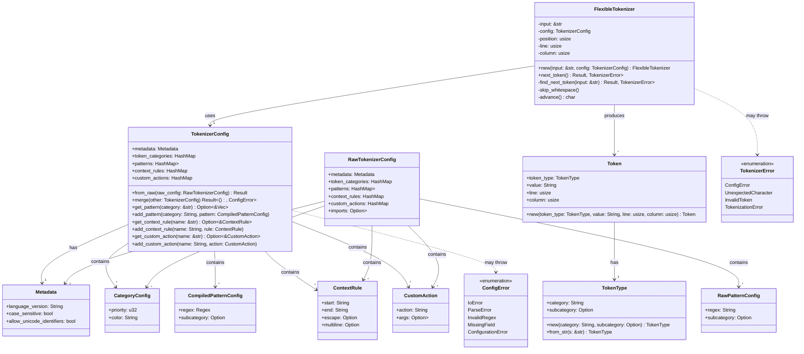
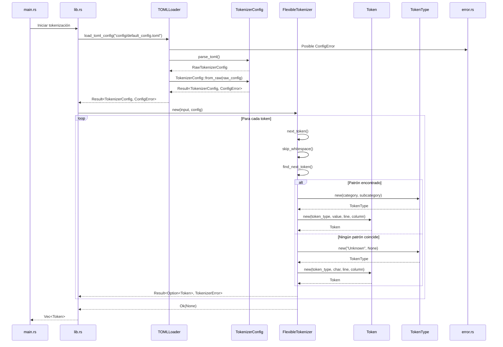
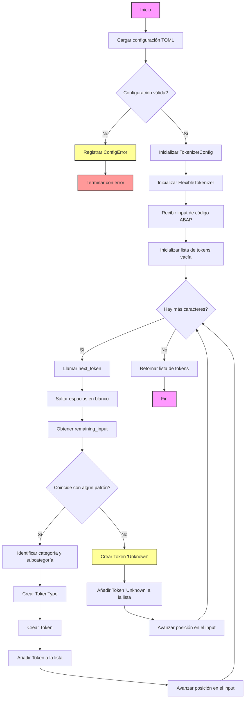

# Diseño del Tokenizador ABAP

## Introducción

Este documento describe el diseño de un tokenizador flexible para el lenguaje ABAP (Advanced Business Application Programming). El tokenizador está implementado en Rust, aprovechando su rendimiento y seguridad, y utiliza archivos de configuración TOML para una fácil personalización. Está diseñado para ser altamente configurable, extensible y capaz de manejar las complejidades específicas del lenguaje ABAP, adaptándose a diferentes variantes y necesidades de análisis.

## Objetivos del Diseño

1. Crear un tokenizador altamente configurable para ABAP, utilizando archivos TOML para definir reglas de tokenización.
2. Permitir la fácil extensión y modificación de reglas de tokenización sin necesidad de cambiar el código fuente.
3. Facilitar la integración con herramientas de análisis y desarrollo, proporcionando una API clara y resultados estructurados.
4. Facilitar la adaptación a diferentes variantes de ABAP mediante configuraciones flexibles.
5. Implementar un manejo robusto de errores para mejorar la fiabilidad y facilitar la depuración.

Estos objetivos se reflejan en la implementación del proyecto de la siguiente manera:

1. La clase `TokenizerConfig` y el uso de archivos TOML permiten una configuración detallada y flexible del tokenizador.
2. La estructura modular del código, especialmente en los componentes de `FlexibleTokenizer` y `TokenizerConfig`, facilita la extensión y modificación de las reglas de tokenización.
3. La API bien definida de `FlexibleTokenizer` y la estructura clara de `Token` permiten una fácil integración con otras herramientas de análisis y desarrollo.
4. El sistema de configuración basado en TOML permite adaptar fácilmente el tokenizador a diferentes variantes de ABAP sin modificar el código fuente.
5. Los enums `ConfigError` y `TokenizerError`, junto con el uso consistente de `Result` en las funciones clave, proporcionan un manejo de errores robusto y detallado.

Las secciones siguientes de este documento detallarán la arquitectura, los componentes principales y el flujo de trabajo del tokenizador, demostrando cómo se logran estos objetivos en la implementación.

## Estructura del Sistema

El Tokenizador ABAP Flexible está diseñado con una arquitectura modular que permite una fácil extensión y mantenimiento. Los componentes principales del sistema son:

### Configuración (módulo `config`)

#### TokenizerConfig (`tokenizer_config.rs`)
- **Función**: Representa la configuración compilada del tokenizador.
- **Componentes**:
  - `token_categories`: Define las categorías de tokens y sus propiedades.
  - `patterns`: Contiene los patrones compilados para la identificación de tokens.
  - `context_rules`: Define reglas para tokens que requieren contexto adicional.
  - `custom_actions`: Especifica acciones personalizadas para ciertos tipos de tokens.
- **Interacciones**: Utilizado por `FlexibleTokenizer` para guiar el proceso de tokenización.

#### TOMLLoader (`toml_loader.rs`)
- **Función**: Carga y parsea el archivo de configuración TOML.
- **Interacciones**: Convierte el archivo TOML en una instancia de `TokenizerConfig`.

### Tokenizador (módulo `tokenizer`)

#### FlexibleTokenizer (`flexible_tokenizer.rs`)
- **Función**: Implementación principal del tokenizador.
- **Componentes**:
  - `input`: El código ABAP a tokenizar.
  - `config`: La configuración compilada del tokenizador.
  - `position`, `line`, `column`: Mantienen el seguimiento de la posición actual en el input.
- **Métodos principales**:
  - `next_token()`: Genera el siguiente token del input.
  - `match_pattern()`: Intenta hacer coincidir el input con los patrones definidos.
- **Interacciones**: Utiliza `TokenizerConfig` para guiar el proceso de tokenización y genera instancias de `Token`.

#### Token (`token.rs`)
- **Función**: Representa un token individual en el código ABAP.
- **Componentes**:
  - `token_type`: El tipo del token.
  - `value`: El valor del token.
  - `line`, `column`: La posición del token en el código fuente.

#### TokenType (`token_type.rs`)
- **Función**: Define el tipo de un token.
- **Componentes**:
  - `category`: La categoría principal del token.
  - `subcategory`: Una subcategoría opcional para una clasificación más detallada.

### Manejo de Errores (`error.rs`)
- **Función**: Define tipos de error personalizados para el sistema.
- **Tipos de error**:
  - `ConfigError`: Errores relacionados con la configuración.
  - `TokenizerError`: Errores que ocurren durante el proceso de tokenización.

### Entrada/Salida del Sistema

#### Entrada
- Archivo de configuración TOML: Define las reglas y patrones de tokenización.
- Código fuente ABAP: El código a ser tokenizado.

#### Salida
- Lista de tokens: Cada token contiene información sobre su tipo, valor y posición en el código fuente.

## Flujo de Trabajo del Sistema

1. Se carga y parsea el archivo de configuración TOML utilizando `TOMLLoader`.
2. Se crea una instancia de `TokenizerConfig` con la configuración parseada.
3. Se inicializa `FlexibleTokenizer` con el código ABAP de entrada y la configuración.
4. `FlexibleTokenizer` procesa el input carácter por carácter:
   - Identifica tokens basándose en los patrones definidos en `TokenizerConfig`.
   - Crea instancias de `Token` para cada token identificado.
   - Maneja casos especiales y reglas de contexto según sea necesario.
5. Se genera una lista de tokens como salida final.

Esta estructura modular permite una fácil extensión del sistema para soportar nuevas características de ABAP o diferentes dialectos del lenguaje, simplemente actualizando el archivo de configuración TOML y, si es necesario, extendiendo la lógica de `FlexibleTokenizer`.

## Estructura de Archivos 
```
abap_tokenizer/
├── Cargo.toml
├── src/
│   ├── main.rs
│   ├── lib.rs
│   ├── config/
│   │   ├── mod.rs
│   │   ├── tokenizer_config.rs
│   │   └── toml_loader.rs
│   ├── tokenizer/
│   │   ├── mod.rs
│   │   ├── flexible_tokenizer.rs
│   │   ├── token.rs
│   │   └── token_type.rs
│   └── error.rs
└── config/
    └── default_config.toml
```

### Explicación de la Estructura de archivos

El proyecto del Tokenizador ABAP Flexible está organizado de la siguiente manera:

#### Raíz del Proyecto
- `Cargo.toml`: Manifiesto del proyecto Rust. Define las dependencias, metadatos y configuración de compilación del proyecto.
- `README.md`: Documentación principal del proyecto, proporcionando una visión general, instrucciones de uso y otra información relevante.

#### Directorio `src/`
Contiene el código fuente principal del proyecto:

- `main.rs`: Punto de entrada para la aplicación de línea de comandos. Maneja los argumentos de la CLI y la inicialización del logger.
- `lib.rs`: Define la estructura del módulo principal y re-exporta componentes públicos. Sirve como punto de entrada cuando el proyecto se usa como biblioteca.
- `error.rs`: Define tipos de error personalizados utilizados en todo el proyecto.

#### Subdirectorio `src/config/`
Maneja la configuración del tokenizador:

- `mod.rs`: Define el módulo de configuración y sus exportaciones.
- `tokenizer_config.rs`: Define las estructuras para la configuración del tokenizador y la lógica de compilación de patrones.
- `toml_loader.rs`: Responsable de cargar y parsear el archivo de configuración TOML.

#### Subdirectorio `src/tokenizer/`
Contiene la implementación principal del tokenizador:

- `mod.rs`: Define el módulo del tokenizador y sus exportaciones.
- `flexible_tokenizer.rs`: Implementación principal del tokenizador flexible.
- `token.rs`: Define la estructura `Token`, que representa un token individual en el código ABAP.
- `token_type.rs`: Define la estructura `TokenType`, que representa el tipo de un token.

### Directorio `config/`
Contiene archivos de configuración:

- `default_config.toml`: Configuración TOML por defecto para el tokenizador. Define los patrones y reglas de tokenización predeterminados.


### Tabla de Descripción de Archivos del Tokenizador ABAP Flexible:

| Nombre del Archivo | Ruta | Función | Interacciones con otros archivos | Notas adicionales |
|--------------------|------|---------|----------------------------------|-------------------|
| Cargo.toml | /Cargo.toml | Manifiesto del proyecto Rust, define dependencias y metadatos | Interactúa con todos los archivos del proyecto a través de la gestión de dependencias | Define la versión de Rust y las dependencias externas |
| main.rs | /src/main.rs | Punto de entrada para la aplicación de línea de comandos | Interactúa con lib.rs y flexible_tokenizer.rs | Maneja los argumentos de línea de comandos y la inicialización del logger |
| lib.rs | /src/lib.rs | Define la estructura del módulo y re-exporta componentes públicos | Interactúa con todos los módulos en src/ | Punto de entrada para la biblioteca cuando se usa como dependencia |
| error.rs | /src/error.rs | Define los tipos de error personalizados | Utilizado por otros módulos para manejar errores | Implementa los traits Error y Display |
| mod.rs | /src/config/mod.rs | Define el módulo de configuración | Interactúa con tokenizer_config.rs y toml_loader.rs | Re-exporta componentes públicos del módulo config |
| tokenizer_config.rs | /src/config/tokenizer_config.rs | Define las estructuras para la configuración del tokenizador | Interactúa con toml_loader.rs y flexible_tokenizer.rs | Implementa la lógica de compilación de patrones |
| toml_loader.rs | /src/config/toml_loader.rs | Carga y parsea el archivo de configuración TOML | Interactúa con tokenizer_config.rs | Utiliza la crate `toml` para parsear el archivo |
| mod.rs | /src/tokenizer/mod.rs | Define el módulo del tokenizador | Interactúa con flexible_tokenizer.rs, token.rs, y token_type.rs | Re-exporta componentes públicos del módulo tokenizer |
| flexible_tokenizer.rs | /src/tokenizer/flexible_tokenizer.rs | Implementación principal del tokenizador flexible | Interactúa con token.rs, token_type.rs, y tokenizer_config.rs | Contiene la lógica principal de tokenización |
| token.rs | /src/tokenizer/token.rs | Define la estructura Token | Utilizado por flexible_tokenizer.rs | Representa un token individual en el código ABAP |
| token_type.rs | /src/tokenizer/token_type.rs | Define la estructura TokenType | Utilizado por token.rs y flexible_tokenizer.rs | Representa el tipo de un token |
| default_config.toml | /config/default_config.toml | Configuración TOML por defecto para el tokenizador | Utilizado por toml_loader.rs | Define los patrones y reglas de tokenización por defecto |
| integration_tests.rs | /tests/integration_tests.rs | Contiene pruebas de integración para el tokenizador | Interactúa con lib.rs y flexible_tokenizer.rs | Verifica el funcionamiento correcto del tokenizador en diferentes escenarios |
| README.md | /README.md | Documentación principal del proyecto | N/A | Proporciona una visión general del proyecto, instrucciones de uso y documentación |


### Beneficios de esta Estructura

1. **Separación de Responsabilidades**: Cada módulo y archivo tiene una responsabilidad clara y bien definida.
2. **Facilidad de Mantenimiento**: La organización lógica facilita encontrar y modificar componentes específicos.
3. **Escalabilidad**: Fácil de extender con nuevos matchers o funcionalidades.
4. **Testabilidad**: Estructura que facilita la escritura de pruebas unitarias y de integración.
5. **Claridad**: La estructura refleja la arquitectura del sistema, mejorando la comprensión del proyecto.
6. **Modularidad**: Permite trabajar en diferentes partes del sistema de forma independiente.

Esta estructura proporciona una base sólida para el desarrollo y mantenimiento a largo plazo del tokenizador ABAP flexible.

## Configuración TOML

El archivo de configuración TOML es una parte crucial del sistema diseñado. Define los tipos de tokens, patrones y reglas especiales que el tokenizador utilizará. Aquí se presenta un ejemplo detallado de cómo podría ser este archivo de configuración:

```toml

# Configuración del Tokenizador ABAP Flexible

[metadata]
language_version = "ABAP 7.5"
case_sensitive = false
allow_unicode_identifiers = true

[token_categories]
Keyword = { priority = 1, color = "blue" }
Identifier = { priority = 2, color = "black" }
Literal = { priority = 3, color = "green" }
Operator = { priority = 4, color = "red" }
Punctuation = { priority = 5, color = "gray" }
Comment = { priority = 6, color = "green" }

[patterns]
Keyword = [
    { regex = "\\b(IF|ELSE|ENDIF|CASE|ENDCASE|DO|ENDDO|WHILE|ENDWHILE|LOOP|ENDLOOP)\\b", subcategory = "ControlFlow" },
    { regex = "\\b(DATA|TYPES|CONSTANTS|FIELD-SYMBOLS)\\b", subcategory = "Declaration" },
    { regex = "\\b(SELECT|FROM|WHERE|ORDER BY|GROUP BY|HAVING)\\b", subcategory = "Database" },
    { regex = "\\b(FORM|ENDFORM|PERFORM|METHOD|ENDMETHOD|FUNCTION|ENDFUNCTION)\\b", subcategory = "Subroutine" },
    { regex = "\\b(CLASS|ENDCLASS|INTERFACE|ENDINTERFACE)\\b", subcategory = "OOP" }
]

Identifier = [
    { regex = "[a-zA-Z_][a-zA-Z0-9_]*" }
]

Literal = [
    { regex = "'[^']*'", subcategory = "String" },
    { regex = "`[^`]*`", subcategory = "String" },
    { regex = "\\b\\d+\\b", subcategory = "Integer" },
    { regex = "\\b\\d+\\.\\d+\\b", subcategory = "Float" }
]

Operator = [
    { regex = "\\+|-|\\*|/|=|<>|<=|>=|<|>|\\bAND\\b|\\bOR\\b|\\bNOT\\b" }
]

Punctuation = [
    { regex = "[.,():;\\[\\]{}]" }
]

Comment = [
    { regex = "\\*.*$", subcategory = "LineComment" },
    { regex = "\".*$", subcategory = "LineComment" }
]

[context_rules]
StringLiteral = { start = "'", end = "'", escape = "''", multiline = true }
TemplateString = { start = "|", end = "|", escape = "||", multiline = true }

[special_rules]
FieldSymbol = { start = "<", end = ">", allow_nested = false }
Pragma = { start = "#", regex = "#[A-Z]+", process_as = "Keyword" }

[custom_actions]
Pragma = { action = "ProcessPragma" }
TemplateString = { action = "ProcessTemplateString" }

```

Explicación de las secciones principales:

1. `[metadata]`: Contiene información general sobre la configuración del tokenizador.

2. `[token_categories]`: Define las categorías principales de tokens, cada una con una prioridad y un color para posible resaltado de sintaxis.

3. `[patterns]`: Aquí se definen los patrones de expresiones regulares para cada categoría de token. Cada patrón puede tener una subcategoría opcional.

   - `Keyword`: Incluye patrones para diferentes tipos de palabras clave en ABAP.
   - `Identifier`: Patrón para identificadores válidos en ABAP.
   - `Literal`: Patrones para diferentes tipos de literales (cadenas, enteros, flotantes).
   - `Operator`: Patrón para operadores aritméticos y lógicos.
   - `Punctuation`: Patrón para símbolos de puntuación.
   - `Comment`: Patrones para comentarios de línea.

4. `[context_rules]`: Define reglas para tokens que requieren un contexto de inicio y fin, como cadenas de texto que pueden abarcar múltiples líneas.

5. `[special_rules]`: Reglas para casos especiales como símbolos de campo y pragmas.

6. `[custom_actions]`: Define acciones personalizadas que el tokenizador puede realizar para ciertos tipos de tokens.


Esta estructura permite una fácil extensión y modificación de las reglas de tokenización sin necesidad de cambiar el código del tokenizador.

## Componentes Principales

El tokenizador ABAP flexible está compuesto por varios componentes clave, cada uno con responsabilidades específicas en el proceso de tokenización. A continuación, se describen los componentes principales:

### TokenType

```rust
pub struct TokenType {
    pub category: String,
    pub subcategory: Option<String>,
}

impl TokenType {
    pub fn new(category: String, subcategory: Option<String>) -> Self;
    pub fn from_str(s: &str) -> Self;
}
```

`TokenType` representa el tipo de un token, incluyendo su categoría principal y una subcategoría opcional. Proporciona métodos para crear nuevas instancias y para convertir desde una representación de cadena.

### Token

```rust
pub struct Token {
    pub token_type: TokenType,
    pub value: String,
    pub line: usize,
    pub column: usize,
}

impl Token {
    pub fn new(token_type: TokenType, value: String, line: usize, column: usize) -> Self;
}
```

`Token` representa un token individual en el código ABAP. Contiene información sobre el tipo de token, su valor, y su posición (línea y columna) en el código fuente.

### FlexibleTokenizer

```rust
pub struct FlexibleTokenizer<'a> {
    input: &'a str,
    config: TokenizerConfig,
    position: usize,
    line: usize,
    column: usize,
}

impl<'a> FlexibleTokenizer<'a> {
    pub fn new(input: &'a str, config: TokenizerConfig) -> Self;
    pub fn next_token(&mut self) -> Result<Option<Token>, TokenizerError>;
    fn find_next_token(&self, input: &str) -> Result<Option<(Token, usize)>, TokenizerError>;
    fn skip_whitespace(&mut self);
    fn advance(&mut self) -> char;
}
```

`FlexibleTokenizer` es el componente central que realiza el proceso de tokenización. Utiliza la configuración proporcionada para analizar el input y generar tokens. El método `next_token` es el punto de entrada principal para obtener el siguiente token del input.

### TokenizerConfig

```rust
pub struct TokenizerConfig {
    pub metadata: Metadata,
    pub token_categories: HashMap<String, CategoryConfig>,
    pub patterns: HashMap<String, Vec<CompiledPatternConfig>>,
    pub context_rules: HashMap<String, ContextRule>,
    pub custom_actions: HashMap<String, CustomAction>,
}

impl TokenizerConfig {
    pub fn from_raw(raw_config: RawTokenizerConfig) -> Result<Self, ConfigError>;
    pub fn merge(&mut self, other: TokenizerConfig) -> Result<(), ConfigError>;
    pub fn get_pattern(&self, category: &str) -> Option<&Vec<CompiledPatternConfig>>;
    pub fn add_pattern(&mut self, category: String, pattern: CompiledPatternConfig);
    pub fn get_context_rule(&self, name: &str) -> Option<&ContextRule>;
    pub fn add_context_rule(&mut self, name: String, rule: ContextRule);
    pub fn get_custom_action(&self, name: &str) -> Option<&CustomAction>;
    pub fn add_custom_action(&mut self, name: String, action: CustomAction);
}
```

`TokenizerConfig` contiene la configuración compilada del tokenizador, incluyendo categorías de tokens, patrones compilados, reglas de contexto y acciones personalizadas. Proporciona métodos para acceder y modificar la configuración.

### Estructuras de Configuración Adicionales

```rust
pub struct Metadata {
    pub language_version: String,
    pub case_sensitive: bool,
    pub allow_unicode_identifiers: bool,
}

pub struct CategoryConfig {
    pub priority: u32,
    pub color: String,
}

pub struct CompiledPatternConfig {
    pub regex: Regex,
    pub subcategory: Option<String>,
}

pub struct ContextRule {
    pub start: String,
    pub end: String,
    pub escape: Option<String>,
    pub multiline: Option<bool>,
}

pub struct CustomAction {
    pub action: String,
    pub args: Option<HashMap<String, String>>,
}
```

Estas estructuras adicionales definen varios aspectos de la configuración del tokenizador, como metadatos del lenguaje, configuraciones de categorías, patrones compilados, reglas de contexto y acciones personalizadas.

### Manejo de Errores

```rust
pub enum ConfigError {
    IoError(String),
    ParseError(String),
    InvalidRegex(String),
    MissingField(String),
    ConfigurationError(String),
}

pub enum TokenizerError {
    ConfigError(ConfigError),
    UnexpectedCharacter(char),
    InvalidToken(String),
    TokenizationError(String),
}
```

`ConfigError` y `TokenizerError` definen los tipos de errores que pueden ocurrir durante la configuración y el proceso de tokenización, respectivamente. Esto permite un manejo de errores robusto y específico en todo el sistema.

Estos componentes trabajan juntos para proporcionar un tokenizador flexible y potente para el lenguaje ABAP, capaz de adaptarse a diferentes variantes y requisitos específicos a través de la configuración.

## Diagramas

### Diagrama de Clases



Explicación del diagrama de clases:

1. `FlexibleTokenizer`: Es la clase principal que realiza la tokenización. Contiene métodos para inicializar el tokenizador, obtener el siguiente token, y manejar el input.

2. `Token`: Representa un token individual, con su tipo, valor y posición en el código fuente.

3. `TokenType`: Define el tipo de un token, incluyendo su categoría y subcategoría opcional.

4. `TokenizerConfig`: Contiene la configuración compilada del tokenizador, incluyendo patrones compilados, categorías de tokens, reglas de contexto y acciones personalizadas.

5. `RawTokenizerConfig`: Representa la configuración raw cargada directamente del archivo TOML, antes de ser procesada.

6. `CompiledPatternConfig` y `RawPatternConfig`: Representan los patrones de tokenización antes y después de la compilación de las expresiones regulares.

7. `CategoryConfig`: Define la configuración para cada categoría de token, incluyendo prioridad y color.

8. `ContextRule`: Define reglas para tokens que requieren un contexto de inicio y fin.

9. `CustomAction`: Representa acciones personalizadas que pueden ser aplicadas durante la tokenización.

Relaciones clave:

- `FlexibleTokenizer` usa `TokenizerConfig` y produce `Token`s.
- Cada `Token` tiene un `TokenType`.
- `TokenizerConfig` contiene colecciones de `CompiledPatternConfig`, `CategoryConfig`, `ContextRule`, y `CustomAction`.
- `RawTokenizerConfig` es similar a `TokenizerConfig`, pero con `RawPatternConfig` en lugar de `CompiledPatternConfig`.

Este diagrama de clases proporciona una visión general de la estructura de nuestro tokenizador, mostrando cómo las diferentes partes del sistema se relacionan entre sí. Destaca la separación entre la configuración raw y compilada, y cómo el tokenizador utiliza estas estructuras para realizar su trabajo.

### Diagrama de Bloques

```mermaid
graph TD
    A[Entrada: Código ABAP] --> B[FlexibleTokenizer]
    C[Archivo de Configuración TOML] --> D[TOMLLoader]
    D --> E[RawTokenizerConfig]
    E --> F[TokenizerConfig]
    F --> B
    B --> G[Proceso de Tokenización]
    G --> H{Coincidencia de Patrones}
    H --> |Coincide| I[Creación de Token]
    H --> |No Coincide| J[Manejo de Token Desconocido]
    I --> K[Lista de Tokens]
    J --> K
    K --> L[Post-procesamiento]
    L --> M[Salida: Tokens ABAP]
    
    O[Manejo de Errores] -.-> B
    O -.-> D
    O -.-> G
    
    P[CategoryConfig] -.-> F
    Q[CompiledPatternConfig] -.-> F
    R[ContextRule] -.-> F
    S[CustomAction] -.-> F
    
    subgraph "Sistema de Configuración"
    C
    D
    E
    F
    P
    Q
    R
    S
    end
    
    subgraph "Núcleo del Tokenizador"
    B
    G
    H
    I
    J
    end
    
    subgraph "Procesamiento de Resultados"
    K
    L
    end
    
    style A fill:#25025e,stroke:#333,stroke-width:2px
    style M fill:#25025e,stroke:#333,stroke-width:2px
    style O fill:#122078,stroke:#333,stroke-width:2px
```



### Explicación del Diagrama de Bloques

El diagrama de bloques representa la estructura y el flujo de datos del Tokenizador ABAP Flexible. A continuación, se detalla cada componente y su función en el sistema:

1. **Entrada y Configuración**:
   - El proceso comienza con dos entradas principales:
     a) El código ABAP a tokenizar.
     b) El archivo de configuración TOML que define las reglas de tokenización.
   - El `TOMLLoader` procesa el archivo TOML y genera una `RawTokenizerConfig`.
   - La `RawTokenizerConfig` se transforma en una `TokenizerConfig` completamente inicializada, que incluye patrones compilados y otras configuraciones procesadas.

2. **Sistema de Configuración**:
   - Incluye `CategoryConfig`, `CompiledPatternConfig`, `ContextRule`, y `CustomAction`.
   - Estos componentes definen cómo se deben identificar y procesar los diferentes tipos de tokens.

3. **Núcleo del Tokenizador**:
   - El `FlexibleTokenizer` es el componente central que utiliza la `TokenizerConfig` para procesar el código ABAP.
   - El proceso de tokenización implica la coincidencia de patrones definidos en la configuración.
   - Cuando se encuentra una coincidencia, se crea un token.
   - Si no se encuentra coincidencia, se maneja como un token desconocido.

4. **Procesamiento de Resultados**:
   - Los tokens creados se agregan a una lista.
   - Se realiza un post-procesamiento opcional, que puede incluir transformaciones adicionales de los tokens.
   - Finalmente, se genera la salida: una lista de tokens ABAP.

5. **Manejo de Errores**:
   - El manejo de errores está integrado en todo el sistema, utilizando los tipos de error definidos en `error.rs`.
   - Interactúa con varios componentes, incluyendo el tokenizador, el cargador de configuración y el proceso de tokenización.
   - Permite una gestión robusta de situaciones excepcionales durante todo el proceso.

Este diseño modular permite una gran flexibilidad y extensibilidad:
- La configuración basada en TOML facilita la adaptación del tokenizador a diferentes variantes de ABAP sin modificar el código fuente.
- La separación clara entre la configuración y la lógica de tokenización permite actualizaciones independientes de cada componente.
- El manejo de errores integrado asegura una operación robusta y facilita la depuración.

El flujo general del sistema es:
1. Cargar y procesar la configuración.
2. Inicializar el tokenizador con la configuración procesada.
3. Procesar el código ABAP entrada por entrada, generando tokens.
4. Manejar casos especiales y errores según sea necesario.
5. Producir la lista final de tokens como salida.

Esta arquitectura proporciona una base sólida para un tokenizador flexible y potente, capaz de adaptarse a las complejidades y variaciones del lenguaje ABAP.

### Diagrama de Secuencia



Este diagrama de secuencia actualizado refleja el flujo de ejecución actual del tokenizador ABAP flexible. Aquí está una explicación detallada del diagrama:

1. El proceso comienza en `main.rs`, que inicia la tokenización a través de `lib.rs`.

2. `lib.rs` carga la configuración TOML utilizando `TOMLLoader`:
   - `load_toml_config` lee y parsea el archivo de configuración.
   - Se maneja la posibilidad de un `ConfigError` durante este proceso.

3. El `TOMLLoader` convierte el contenido TOML en una `RawTokenizerConfig`.

4. La `RawTokenizerConfig` se convierte en una `TokenizerConfig` completamente inicializada usando `TokenizerConfig::from_raw`.

5. Con la configuración cargada, `lib.rs` crea una nueva instancia de `FlexibleTokenizer`.

6. Comienza un bucle de tokenización, donde `FlexibleTokenizer` procesa el input:
   - `next_token()` es llamado repetidamente para obtener cada token.
   - Primero, se saltan los espacios en blanco con `skip_whitespace()`.
   - `find_next_token()` intenta hacer coincidir el input con los patrones definidos.

7. Si se encuentra un patrón:
   - Se crea un nuevo `TokenType` con la categoría y subcategoría correspondientes.
   - Se crea un nuevo `Token` con el `TokenType`, valor y posición.

8. Si no se encuentra ningún patrón:
   - Se crea un `TokenType` "Unknown".
   - Se crea un `Token` "Unknown" con el carácter no reconocido.

9. Cada `Token` generado se devuelve como `Result<Option<Token>, TokenizerError>` a `lib.rs`.

10. El proceso continúa hasta que no hay más input para tokenizar (`Ok(None)` es devuelto).

11. Finalmente, `lib.rs` devuelve un vector de todos los tokens a `main.rs`.

Este diagrama muestra claramente:
- El manejo de errores integrado en varios puntos del proceso.
- La conversión de la configuración raw a una forma utilizable.
- El proceso iterativo de tokenización.
- La creación de tokens tanto para patrones reconocidos como para input desconocido.


### Diagrama de Actividades

Aqui está el diagrama de actividades. Este diagrama refleja con precisión el flujo de trabajo actual del tokenizador ABAP flexible.




Este diagrama de actividades refleja el flujo de trabajo implementado en el código fuente del tokenizador ABAP flexible. Aquí está una explicación detallada del diagrama:

1. El proceso comienza con la carga de la configuración TOML.

2. Se verifica si la configuración es válida. Si no lo es, se registra un `ConfigError` y el proceso termina con un error.

3. Si la configuración es válida, se inicializa `TokenizerConfig` y luego `FlexibleTokenizer`.

4. Se recibe el input de código ABAP y se inicializa una lista vacía para almacenar los tokens.

5. El proceso principal es un bucle que continúa mientras haya más caracteres en el input:
   
   a. Se llama al método `next_token()`.
   
   b. Se saltan los espacios en blanco.
   
   c. Se obtiene el `remaining_input` a partir de la posición actual.
   
   d. Se intenta hacer coincidir el input con los patrones definidos en la configuración.
   
   e. Si coincide con un patrón:
      - Se identifica la categoría y subcategoría del token.
      - Se crea un `TokenType` y luego un `Token`.
      - Se añade el `Token` a la lista.
   
   f. Si no coincide con ningún patrón:
      - Se crea un Token 'Unknown'.
      - Se añade el Token 'Unknown' a la lista.
   
   g. Se avanza la posición en el input.

6. Cuando no hay más caracteres, se retorna la lista completa de tokens.

Este diagrama de actividades proporciona una visión clara del flujo de trabajo del tokenizador, mostrando las decisiones que se toman en cada paso del proceso. Destaca la naturaleza iterativa del proceso de tokenización y cómo se manejan diferentes casos (coincidencias de patrones, caracteres desconocidos).

## Flujo de Trabajo

1. Carga de la configuración TOML.
2. Inicialización del tokenizador con la configuración cargada.
3. Procesamiento del código ABAP carácter por carácter:
   - Saltar espacios en blanco.
   - Intentar hacer coincidir patrones definidos en la configuración.
   - Crear tokens basados en las coincidencias encontradas.
   - Manejar casos especiales y reglas de contexto.
4. Generación de la lista final de tokens.